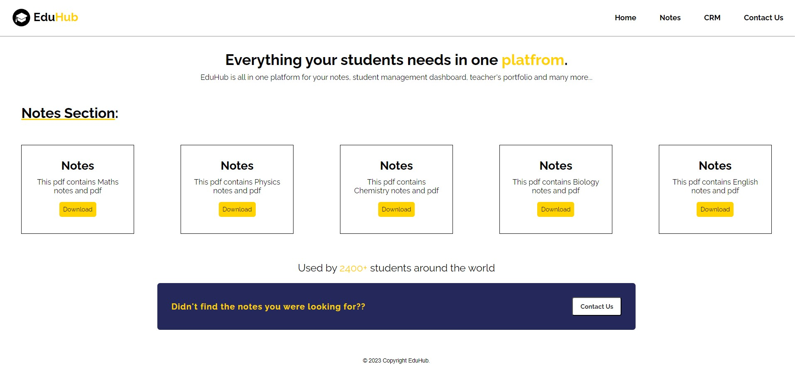

# Notes section V1.1

  This website will contain currently all notes of 1st year Students.

## Feature

1. Have all in one Notes dash board for 1st year students(currently).
2. They can easily download it through g-drive.
3. Have a analytics of users activity and click and downloads on website.
4. Call to Action (We will collect emails from users)

&nbsp;
## Website UI

<!--  -->

## Demo

Website 👇

[Demo](https://mohdfaizan5.github.io/eduhub/)

## Technical Details

### Colors:

orange:    rgb(255, 210, 0)

brown:      rgb(45, 45, 45)

darkbrown:  rgb(31, 34, 35) 

white:      rgb(255, 255, 255)

dark-blue:  rgb(36, 40, 91)

[img](/assets/color-pallete.PNG)

### font:
"Railway"

## Success Matrics